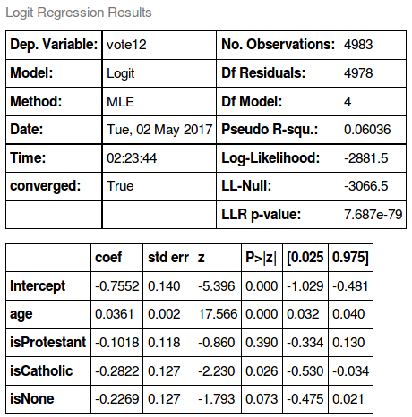

# How Do You Predict Who Will Vote?
### By Sean Carter

##### Motivation:

The primary goal of this investigation is to understand what most strongly influences a person's tendency to vote in an American presidential election. There are many basic patterns that are well explored - for example, younger people are currently [less likely to vote](http://www.npr.org/2016/05/16/478237882/millennials-now-rival-boomers-as-a-political-force-but-will-they-actually-vote). But there are many other demographic variables out there, and some of them might serve as better indicators of voting likelihood, and even account for the effect of age.

To do this, we can explore data from the [General Social Survey (GSS)](http://gss.norc.org/), which contains both voting data and an extraordinary number of demographic variables.

----------------------------

###### How Predictive is Age?
Age is an excellent variable to use as a baseline, since many other studies have shown links between age and a tendency to vote. To begin, we can build a logistic regression model for whether or not people voted, based on age. To focus on more recent data, this model is *only* based on whether a respondent voted in the 2012 election, the most recent year that the GSS has data for.

Here are the results of the regression:

We can see from the pseudo R-squared value that this isn't a particularly accurate predictive model, but this is definitely a statistically significant result.

###### What About Religion?

There are many demographic variables that correlate with age that could serve as better predictors. For example, age correlates strongly with religious affiliation. So, we can build a model that incorporates the 3 dominant religious affiliations in the US, according to the GSS: Protestant, Catholic, and None

This shows that religion is a surprisingly poor predictor of a voter's chance of voting. Catholicism is the only statistically significant predictor - both Protestants and 'Nones' aren't sufficiently more or less likely to vote to make this significant at all.

###### Class and Race?

The GSS dataset also provides us with a variable encoding race, as well as one encoding the 'socioeconomic index', which is measured from a large number of different occupational catagories.

Here, we can see that race and class are also both statistically significant. What is particularly interesting is that adding them dramatically decreases the already poor performance of religion - their effect could easily occur by chance, and the size of their proposed effects drops sharply as well. It is also shows that respondents identifying as both black and white were more likely to vote.

###### Other Variables

Finally, the model below incorporates a wide range of potential variables. The P values shown indicate that all of them are statistically significant, except for "isGovt" (a variable encoding whether or not the respondent knows that they work for the government).

On interesting feature is that happy people are much more likely to vote, while people who say that others can't be trusted are less likely. Further investigations could explore whether this is because an optimistic attitude promotes some amount of trust in the system, or some sense of agency in voting. As you might expect, a strong party identity is an excellent predictor of voting habits. This could be for similar reasons - i.e, a trust in their party to get things right.

Overall, this model performs much better than one that only takes age into account - the pseudo R-squared value is much larger, which means that a greater percentage of the variability of the model is explained by the independent variables.
